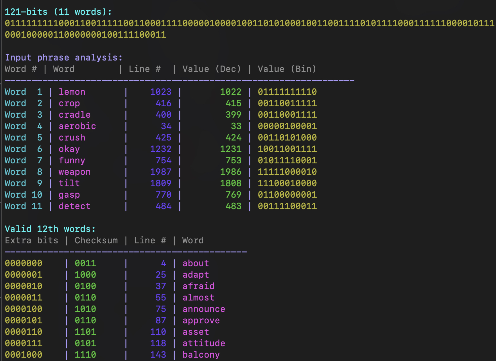

# BIP39 Checksum Checker

### Disclaimer
This was purely for learning and educational purposes. While it should work, it is not intended to be used as a recovery tool, and I do not recommend relying on it.

This script analyzes BIP39 seed phrases, specifically focusing on 12-word or 24-word seed phrases (Most common).  

Given the first 12 or 23 words, it will generate all the possible final (12th or 24th) words. 

# What is BIP-39?
BIP-39 stands for **Bitcoin Improvement Proposal 39**. It defines a standard for creating human-readable mnemonic phrases (typically 12 or 24 words) that can be used to generate deterministic wallets — most commonly used in Bitcoin and many other cryptocurrencies.

Instead of a hex string, for example:
```
07cf7730bca69cd65b59d459bcdd24ed386a4ee1740f20b98d70c489f1ad64db3c468c11615efe88b3bf3554025447149239d77e48ded1c15eededa77be77c46
```

BIP-39 means you will get a mnemonic phrase that reads like (for example) :
```
actual enroll require budget imitate random radar adult bright battle harbor fluid among sense blame afraid era silver please tuna bracket dry rent leave

```

They both represent the same thing but one is:
 - Easy to read and write down or memorize
 - Deterministic. The same phrase always generates the same wallet)
 - Compatible across many wallets (e.g., Ledger, Trezor, MetaMask)
 - Recoverable — lose your device, keep your phrase, you still have your Bitcoin



## How BIP39 Seed Phrases Work

### 12-word Seed Phrase Construction
- First 11 words provide 121 bits of entropy (11 × 11 bits per word)
- 7 additional bits are added to make 128 bits of entropy
- A 4-bit checksum is calculated by taking the first 4 bits of the SHA256 hash of the 128-bit entropy
- The 12th word is determined by combining the 7 additional bits and the 4-bit checksum to form an 11-bit index
- 
### 24-word Seed Phrase Construction:
- First 23 words provide 253 bits of entropy (23 × 11 bits per word)
- 3 additional bits are added to make 256 bits of entropy
- An 8-bit checksum is calculated by taking the first 8 bits of the SHA256 hash of the 256-bit entropy
- The 24th word is determined by combining the 3 additional bits and the 8-bit checksum to form an 11-bit index

## Usage

```bash
python3 get-checksum-12-words.py "word1 word2 word3 ... word11"

python3 get-checksum-24-words.py "word1 word2 word3 ... word23"
