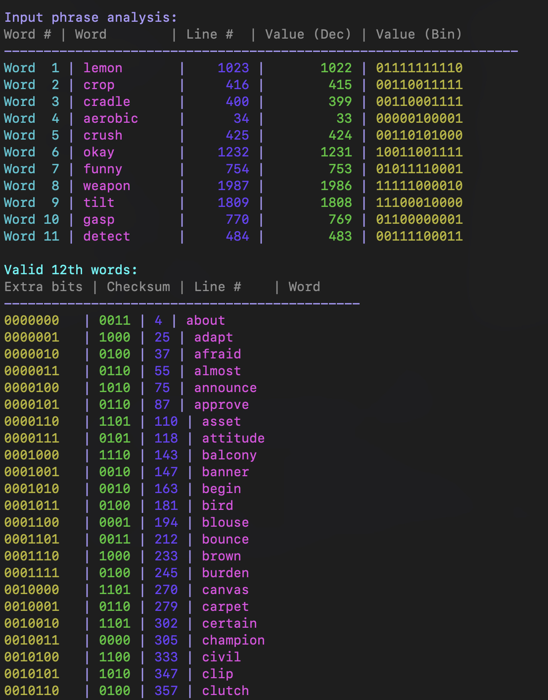

# BIP39 Checksum Checker

This is just me trying to learn how things work, don't rely on this as a tool!

This script analyzes BIP39 seed phrases, specifically focusing on 12-word or 24-word seed phrases (Most common).  Given the first 12 or 23 words, will produce all possible final (12th or 24th) words. 



## How BIP39 Seed Phrases Work

### 12-word Seed Phrase Construction
- First 11 words provide 121 bits of entropy (11 × 11 bits per word)
- 7 additional bits are added to make 128 bits of entropy
- A 4-bit checksum is calculated by taking the first 4 bits of the SHA256 hash of the 128-bit entropy
- The 12th word is determined by combining the 7 additional bits and the 4-bit checksum to form an 11-bit index
- 
### 24-word Seed Phrase Construction:
- First 23 words provide 253 bits of entropy (23 × 11 bits per word)
- 3 additional bits are added to make 256 bits of entropy
- An 8-bit checksum is calculated by taking the first 8 bits of the SHA256 hash of the 256-bit entropy
- The 24th word is determined by combining the 3 additional bits and the 8-bit checksum to form an 11-bit index

## Usage

```bash
python3 get-checksum-12-words.py "word1 word2 word3 ... word11"

python3 get-checksum-24-words.py "word1 word2 word3 ... word23"
